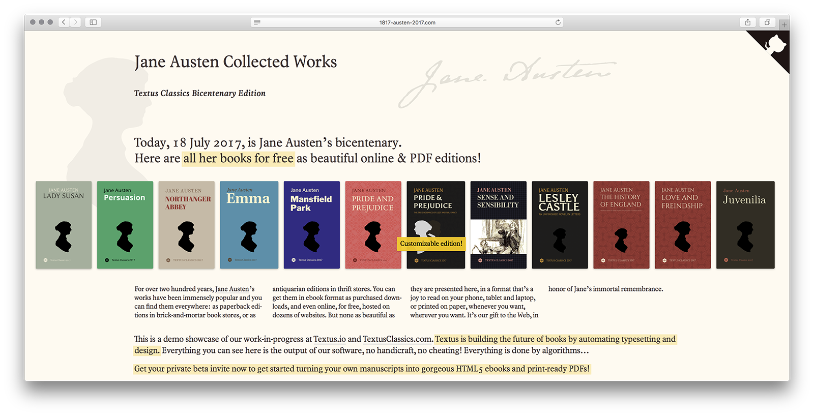

# Jane Austen: Collected Works

This repository contains the source texts to [Jane Austen](https://en.wikipedia.org/wiki/Jane_Austen)’s (1775–1817) _Collected Works_.

## [Textus Classics Bicentenary Edition](http://JaneAusten2017.com)

The text files to the books offered in this repository have been prepared at the occasion of Jane Austen’s bicentenary (July 18, 1817–2017), and are the source to the **Textus Classics edition** online available **for free at [JaneAusten2017.com](http://JaneAusten2017.com)**.

It’s a demo showcase of our work-in-progress at [Textus.io](http://www.textus.io/) and [TextusClassics.com](http://textusclassics.com/). **Textus is building the future of books by automating typesetting and design.**

All the online HTML5 ebooks and PDFs offered for free at [JaneAusten2017.com](http://JaneAusten2017.com) have been typeset and generated automatically using [Textus.io](http://www.textus.io/). The markdown plain text source files contained in this repository was the only required input, along with a simple cover artwork (`cover.svg`) and metadata (`meta.yml`) file.

**Request your private beta invite to soon get started turning your own manuscripts into gorgeous HTML5 ebooks and print-ready PDFs!** For more information, please visit [Textus.io](http://www.textus.io/) and subscribe to our mailing list.

## Technical details and contents

The main source file to each book is stored in a single markdown file (the `.md` extension denotes that the text has been formatted using a [markdown compliant](http://commonmark.org) markup syntax), each stored in a separate folder, along with any assets (like image and metadata files).

- `1787–93 | Juvenilia (PG 1211)`
- `1790 | Love and Freindship (PG 1211)`
- `1791 | The history of England (PG 1211)`
- `1792 | Lesley Castle (PG 1211)`
- `1811 | Sense and Sensibility (PG 21839)`
- `1813 | Pride and Prejudice (PG 1342)`
- `1814 | Mansfield Park (PG 141)`
- `1815 | Emma (PG 158)`
- `1818 | Northanger Abbey (PG 121)`
- `1818 | Persuasion (PG 105)`
- `1871 | Lady Susan (PG 946)`

## Collaborating

If you find any issues with the texts, please report them here or by clicking the [Issues tab](https://github.com/textvs/Austen-Works/issues) to this repository. Please copy-and-paste the entire sentence that contains the error, and what the text should read. For advanced users, you can make a Pull Request here on Github.

If you find formatting or typesetting errors, or would want to make suggestions on the styling of the Textus Classics books published for free on [JaneAusten2017.com](http://JaneAusten2017.com), then by all means, please get in touch! Jane Austen’s _Collected Works_ are a first public showcase of what [Textus](http://www.textus.io/) is capable of, yet. We would love to get your feedback on typography and styling, so we can improve our work.

## TODO

All of Jane Austen’s major novels are present in this repository. They were grabbed from the _Complete Collected Works_ as published by [Project Gutenberg, #31100](https://www.gutenberg.org/ebooks/31100), after which they have been converted (from html to markdown) and reformatted. For more info, please consult the commit history.

- [ ] A carefully crafted digital edition of _Pride and Prejudice_ is available from [Standard Ebooks](https://standardebooks.org/ebooks/jane-austen/pride-and-prejudice); Textus Classics has a [deprecated repository](https://github.com/textvs/Pride-and-Prejudice_1342) to an earlier release (February 2017) containing the same work. Both should be collated and merged with the text contained in this repository.

- [ ] Besides the main novels and minor posthumously published writings present in the PG Collected Works, Project Gutenberg also has the _Letters of Jane Austen_ ([PG 42078](https://www.gutenberg.org/files/42078/42078-h/42078-h.htm)), which is lacking from this repository.

- [ ] In addition, [Wikipedia](https://en.wikipedia.org/wiki/Jane_Austen#List_of_works) lists quite a few other works: some unfinished fiction and other works, and three volumes of ‘Juvenilia’. Most of these minor writings are lacking from this repository.

- [ ] On [Pemberley.com](http://www.pemberley.com/janeinfo/) there’s what seems an exhaustive overview, listing all Jane Austen’s writings, with many links to different (and annotated) digital online editions. It might be useful to merge and add these as well.

## Out of Copyright

The Works contained in this online electronic repository have been first published long before 1923; the author of the Works deceased more than 70 years ago. It follows, world-wide, that these Works have entered the Public Domain and are free of copyrights. The texts and files contained inhere are offered for free for all to enjoy and to do with as one pleases.
